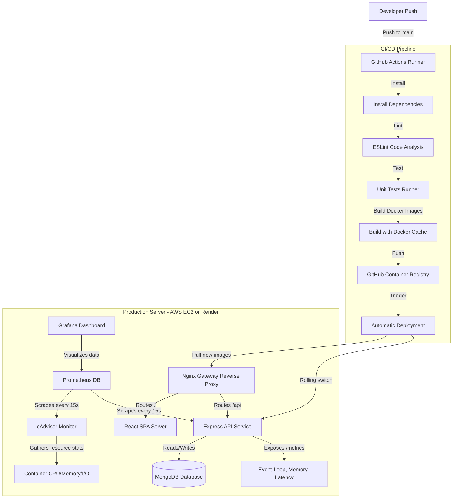

# 🛠️ UpRise - Production DevOps Architecture

UpRise is a production-ready skill learning platform built using a robust, containerized microservices architecture. This repository hosts both the application source code and the complete infrastructure configuration (CI/CD, Monitoring, Centralized Logging, and Automated Zero-Downtime Deployment).

---

## 📐 DevOps System Architecture

Below is the diagram of the continuous integration, continuous delivery, monitoring, and traffic routing pipeline:



---

## 📂 Final Folder Structure

```text
UpRise/
│
├── .github/
│   └── workflows/
│       └── deploy.yml          # GitHub Actions CI/CD pipeline definition
│
├── backend/                    # Node.js + Express API Service
│   ├── config/                 # Database config
│   ├── controllers/            # Controller logics (auth, courses, etc.)
│   ├── middleware/             # Auth, error handler middlewares
│   ├── models/                 # Mongoose schema definitions
│   ├── routes/                 # Express route mappings
│   ├── utils/
│   │   ├── logger.js           # Winston Logging Utility
│   │   ├── metrics.js          # prom-client metrics initialization
│   │   └── test_placeholder.js # Native Node.js test runner suite
│   ├── eslint.config.js        # Backend linting config
│   ├── Dockerfile              # Multi-stage Backend Docker image definition
│   └── package.json            # Backend scripts & packages
│
├── frontend/                   # React SPA Client
│   ├── src/                    # Source files
│   ├── nginx.conf              # SPA Client Nginx routing
│   ├── eslint.config.js        # Frontend linting config
│   ├── Dockerfile              # Multi-stage Frontend Docker image definition
│   └── package.json            # Frontend scripts & packages
│
├── monitoring/                 # Monitoring Stack configurations
│   ├── prometheus/
│   │   └── prometheus.yml      # Prometheus scraping target intervals
│   └── grafana/
│       └── provisioning/       # Automated Datasource & Dashboard provisioning
│           ├── dashboards/
│           │   ├── dashboards.yml
│           │   └── uprise-dashboard.json
│           └── datasources/
│               └── datasource.yml
│
├── nginx/                      # Main API Gateway Router
│   └── nginx.conf              # Main Nginx proxy routing config
│
├── scripts/                    # Automation Scripts
│   ├── setup-ec2.sh            # Installs Docker stack on AWS EC2
│   └── deploy.sh               # Zero-downtime rolling deployment script
│
├── docker-compose.yml          # Multi-container Compose orchestration
├── render.yaml                 # Render Infrastructure-as-Code Blueprint spec
└── README.md                   # This operations documentation file
```

---

## ⚙️ Setup & Local Orchestration

Follow these steps to run the complete environment locally, including the monitoring and logging dashboard.

### Prerequisites
- Install **Docker** and **Docker Compose** on your host.

### Step 1: Initialize the Environment
Clone this repository and create a `.env` file inside the `backend/` directory:
```bash
PORT=5000
NODE_ENV=production
MONGODB_URI=mongodb://mongo:27017/UpRise
JWT_SECRET=superSecretProductionKeyHere
```

### Step 2: Spin Up the Infrastructure
Start all services (MongoDB, Backend, Frontend, Nginx, cAdvisor, Prometheus, Grafana):
```bash
docker compose up -d --build
```

### Step 3: Access Ports & Dashboards
Once the containers are up, the following services will be available:
- **Application Gateway**: http://localhost (Nginx routes `/` to Frontend and `/api` to Backend)
- **Direct Backend API**: http://localhost:5000
- **Prometheus Console**: http://localhost:9090
- **Grafana Dashboards**: http://localhost:3000 (Use username `admin` and password `admin`. The Prometheus datasource and system resources dashboard are pre-loaded automatically!)

---

## 🚀 Cloud Deployment Guides

### Option A: AWS EC2 (Recommended for scale)

1. **Provision EC2 Instance**: Launch an Ubuntu instance in AWS EC2 Console, and open ports `80` (HTTP), `443` (HTTPS), and optionally `3000` (Grafana) in the Security Group.
2. **Configure Host**: Log into your instance via SSH and copy the configuration script:
   ```bash
   curl -o setup-ec2.sh https://raw.githubusercontent.com/<user>/UpRise/main/scripts/setup-ec2.sh
   chmod +x setup-ec2.sh
   ./setup-ec2.sh
   ```
3. **Deploy Application**: Clone your repository into `/app/uprise`, modify the `/app/uprise/.env.production` file, and execute the deploy script:
   ```bash
   chmod +x /app/uprise/scripts/deploy.sh
   /app/uprise/scripts/deploy.sh
   ```

### Option B: Render Blueprint Deployment

1. Go to the [Render Dashboard](https://dashboard.render.com).
2. Select **Blueprints** -> **New Blueprint Instance**.
3. Link your GitHub repository.
4. Render will parse the `render.yaml` file automatically and provision:
   - The Express Node.js Backend service.
   - The Static SPA Frontend served inside Nginx.
5. Provide your `MONGODB_URI` connection string (e.g. from MongoDB Atlas) when prompted in the UI.

---

## 📊 Monitoring & Logging Operations

### Logging (Winston & Morgan)
Logs are recorded inside the backend container and stored in a shared volume.
- **`logs/combined.log`**: Standard operational logs, startup markers, and HTTP request logs formatted by Morgan.
- **`logs/error.log`**: Operational exceptions, authentication failures, and bad request exceptions, including stack traces.

To check operational logs from the host:
```bash
docker compose logs -f backend
```

### Monitoring (Prometheus & Grafana)
Our system measures runtime metrics:
- **CPU/RAM metrics** are collected from the host docker socket via cAdvisor.
- **API Request rate & Response Latency** are collected inside Node.js via the `prom-client` library.
- Custom metrics are plotted inside Grafana. Navigate to **Dashboards -> Operations -> UpRise Production Operations Dashboard** on http://localhost:3000.

---

## 💡 Troubleshooting Guide

### 1. Database Connection Failures
* **Symptom**: Backend container exits with `Database Connection Error: connect ECONNREFUSED`.
* **Fix**: Ensure that the database service is fully healthy. The backend service uses a health check: `depends_on: mongo: condition: service_healthy`. Wait for the mongo container to finish booting.

### 2. Port Collisions (Host Ports)
* **Symptom**: `Bind for 0.0.0.0:80 failed: port is already allocated` or `3000/9090 port conflict`.
* **Fix**: Verify if another service (like local Apache, Nginx, or Skype) is using those ports. You can change host ports in `docker-compose.yml` under `ports:`.

### 3. Missing JWT Secret
* **Symptom**: Backend container logs `FATAL ERROR: JWT_SECRET is not defined` and exits immediately.
* **Fix**: Define `JWT_SECRET` inside your environment file (`backend/.env` or `.env.production`).

### 4. cAdvisor Socket Permissions on AWS EC2
* **Symptom**: cAdvisor container lacks permissions to mount `/var/run/docker.sock`.
* **Fix**: Ensure the user running Docker is in the `docker` user group (`sudo usermod -aG docker ubuntu` followed by a session logout).